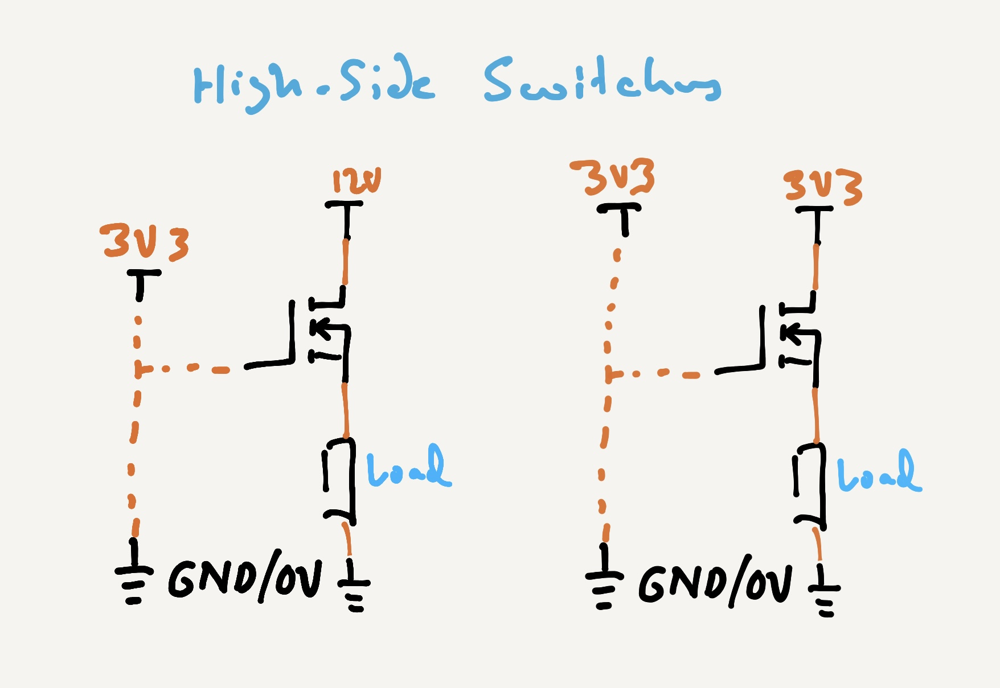
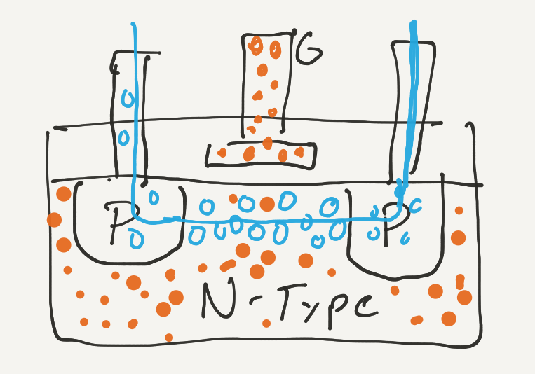
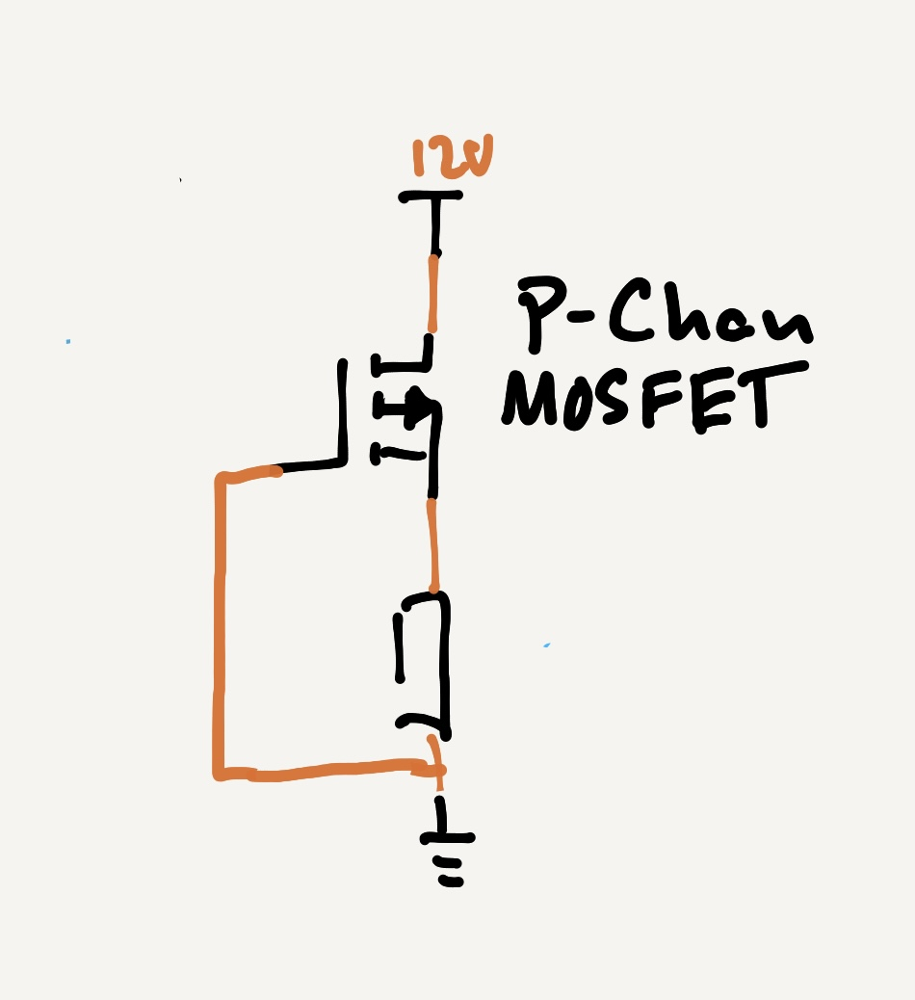
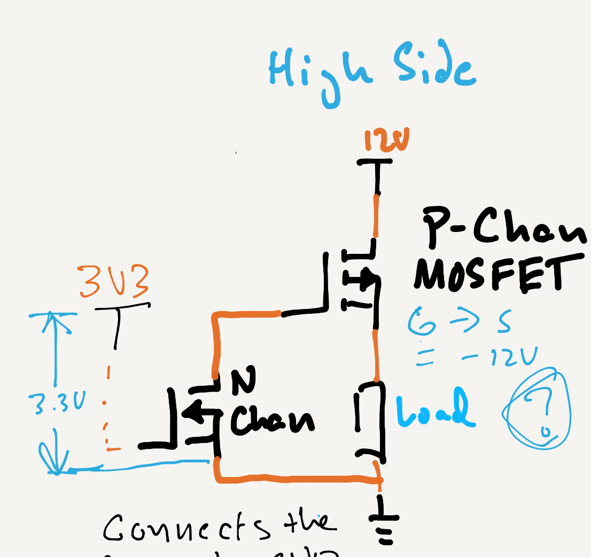

Imagine that in your design, you needed to switch on the high-side. Perhaps you needed to provide a `HIGH` signal to a circuit to indicate it needed to do something. Let's look at two scenarios, the first is controlling a larger signal with a smaller one (a common practice when controlling loads like motors), and a second scenario where the signal is the same voltage:

Each one of these scenarios presents a different problem in regards to the Gate-to-Source Voltage (`V``GS`):

* **Scenario 1** - In the first case where a smaller control signal is used, the `V``GS` would either be `9V` when the controlling signal is `HIGH`, or `12V` when the controlling signal is `LOW`. Either way, the MOSFET is likely to be `ON` because the `V``GS` is so high. You wouldn't be able to ever turn it off.
* **Scenario 2** - In the second case, where the same control signal is used, `V``GS` would be `0V`, due to Kirchhoff's Voltage Law: 
    

## Kirchhoff's Voltage Law

Recall from Kirchhoff's second law, that as current flows from the positive voltage source to ground, it's voltage drops as it hits resistance:

By the time it gets to the end at `GND`, then the voltage potential is effectively `0V`.

In the High-side circuit above, the main resistance in the circuit is the load. Which means that the voltage potential at the source of the MOSFET is the same as at the gate, so there is no difference and therefore, `V``GS` would be `0V`. 

### High-Side Switch, Low-Side Load

But there is a potential difference between the `Gate` and `GND`, on the low-side of the circuit, so why not simply wire that up:

However, recall that the gate on N-Channel MOSFETs work on positively charged holes:

Bringing negatively charged electrons wouldn't open the N-Channel necessary for current to flow.

## P-Channel MOSFET

For this reason, we need to invert the construction of the N-Channel MOSFET, which is exactly what a P-Channel MOSFET does. It uses a negative charge at the Gate to bring the postively charged, minority charge carriers (holes) into the P-Channel to conduct:

With this, we can then pull the gate down to `GND` and turn on the gate on.

This introduces one final thing we need to solve, name: controlling the `ON`/`OFF` of that P-Channel MOSFET. It's all well and good to pull it to `GND`/`0V` and have it conduct, but the whole point is to be able to control that conductance. Generally, you only want a P-Channel enhancement MOSFET to conduct when you energize or set `HIGH` an IO pin.

## Controlling a High-Side P-Channel MOSFET.

The answer is simple, add an N-Channel MOSFET in front of the P-Channel MOSFET in the following fashion:

When the N-Channel gate is pulled `LOW`, it's off, and nothing flows through it. When the gate is pulled `HIGH`, then electrons are allowed to flow from `GND` to the P-Channel gate, and it turns on, in turn, energizing the load!

