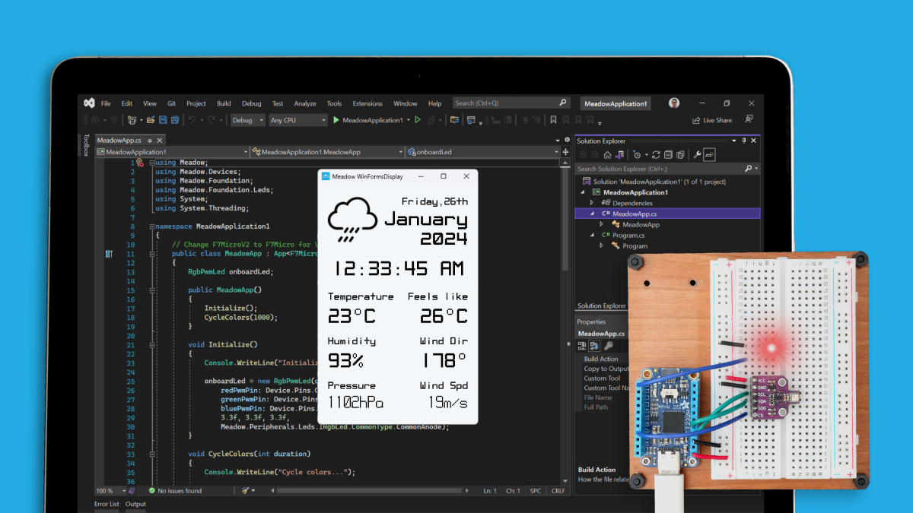
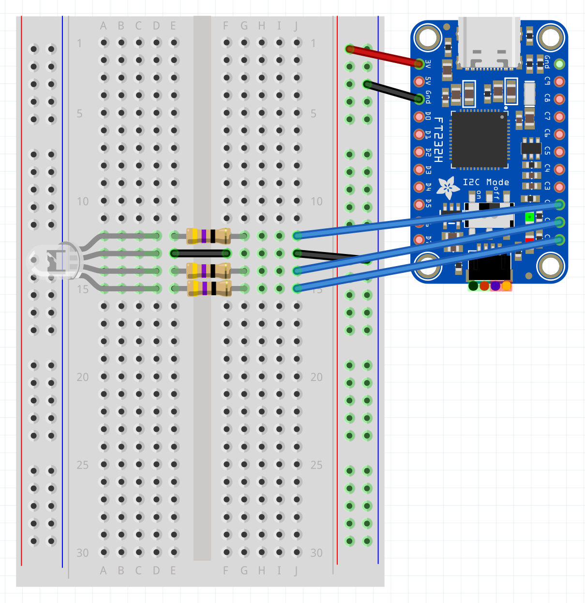
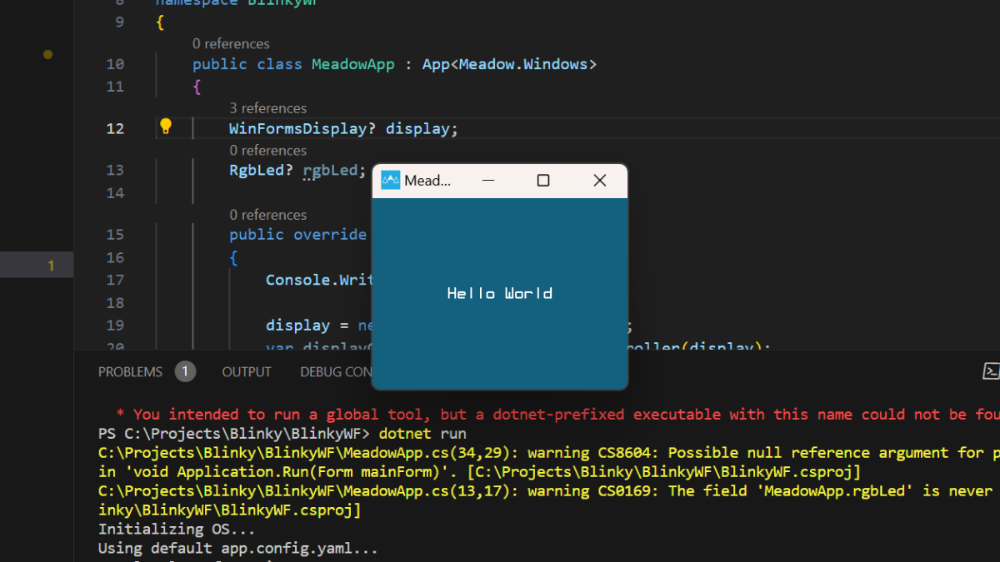

import Tabs from '@theme/Tabs';
import TabItem from '@theme/TabItem'



<Tabs>
  <TabItem value="visualstudio" label="Visual Studio 2022" default>

### Step 1 - Install .NET Runtime

Download and install the latest version of the [.NET runtime](https://dotnet.microsoft.com/en-us/download).

### Step 2 - Install Visual Studio

Download and Install [Visual Studio](https://visualstudio.microsoft.com/) for either Windows or macOS to prepare your development machine. Community edition will work fine.

### Step 3 - Add Meadow Visual Studio Extension

Open Visual Studio’s Extensions Manager and install the [VS 2022 Tools for Meadow](https://marketplace.visualstudio.com/items?itemName=WildernessLabs.vsmeadow2022) Extension.

### Step 4 - Create your first Meadow.Windows application

TBD

  </TabItem>
  <TabItem value="vscode" label="Visual Studio Code">

### Step 1 - Install .NET Runtime

Download and install the latest version of the [.NET runtime](https://dotnet.microsoft.com/en-us/download).

### Step 2 - Install Visual Studio Code

Download and Install [Visual Studio Code](https://visualstudio.microsoft.com/) to prepare your development machine.

### Step 3 - Install Meadow Project Templates

Open a Terminal and enter the following command to install a list of Meadow project templates:

```console
dotnet new install WildernessLabs.Meadow.Template
```

When installed, you’ll see a list of Templates available

```console
C:\Users\ramir>dotnet new install WildernessLabs.Meadow.Template
The following template packages will be installed:
   WildernessLabs.Meadow.Template

Success: WildernessLabs.Meadow.Template::1.8.0.2 installed the following templates:
Template Name                               Short Name         Language        Tags
------------------------------------------  -----------------  --------------  --------------
Meadow App (Core-Compute Module)            CoreComputeModule  [C#],F#,VB.NET  Meadow/Console
Meadow App (Feather F7)                     FeatherF7          [C#],F#,VB.NET  Meadow/Console
Meadow App (Project Lab)                    ProjectLab         [C#]            Meadow/Console
Meadow Library                              Library            [C#],F#,VB.NET  Meadow/Library
Meadow.Linux App (Jetson Nano)              JetsonNano         [C#]            Meadow/Console
Meadow.Linux App (Raspberry Pi)             RaspberryPi        [C#]            Meadow/Console
Meadow.Linux App (Seeed Studio reTerminal)  reTerminal         [C#]            Meadow/Console
Meadow.Windows App (WinForms + Hardware)    WinFormsHardware   [C#]            Meadow/Console
Meadow.Windows App (WinForms)               WinForms           [C#]            Meadow/Console
```

### Step 4 - Create your first Meadow application

Lets verify everything is set up by deploying your first Meadow application. 

Open VSCode in a new Terminal within enter the following command to create a new Meadow.Windows project:

```console
dotnet new WinFormsHardware -n WinFormsHardwareDemo
```

This Meadow.Windows application controls an RGB LED connected to a FT232H IO Expander that you can connect to your machine via USB-C, and opens a 320x240 pixel WinForms window saying `Hello, World` using MicroLayout.



### Step 5 - Deploy your application

With no code changes, let's run this app on your machine. 

In VSCode, open a terminal inside the project folder, build the project with the command:

```console
dotnet build
```

And finally to run the Meadow application, use the command:

```console
dotnet run
```

At that point, you should see the application’s output in the console and the RGB LED cycling through different colors:


And a WinForm window should show up in the center of the screen saying `Hello, World`, like below:



  </TabItem>
</Tabs>