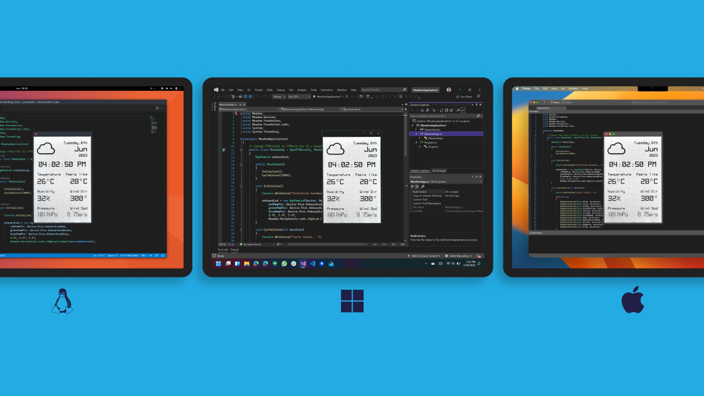

Meadow.Desktop offers quick-prototyping and high-responsiveness environments for developing Meadow code that can run on Windows and various Linux distributions, including Windows Subsystem for Linux 2 (WSL2). With appropriate hardware, such as certain single-board computers (SBCs) or using add-on hardware like FT232H modules, you can even access general-purpose input/output (GPIO) pins, SPI, and I2C as you would on a Meadow Feather or Core-Compute module.

You can also quickly prototype graphics using an emulated IDisplay object that renders to a standard window on your Windows machine before deploying them to component displays. Additionally, running Meadow applications on more extensive hardware can also provide capabilities for intensive workloads requiring much more processing power.

* [Hello, Meadow.Windows](../Getting_Started_Meadow.Desktop/Getting_Started_Windows/index.md)
* [Hello, Meadow.Linux](../Getting_Started_Meadow.Desktop/Getting_Started_Linux/index.md)
* [Hello, Meadow.Mac](../Getting_Started_Meadow.Desktop/Getting_Started_Mac/index.md)
