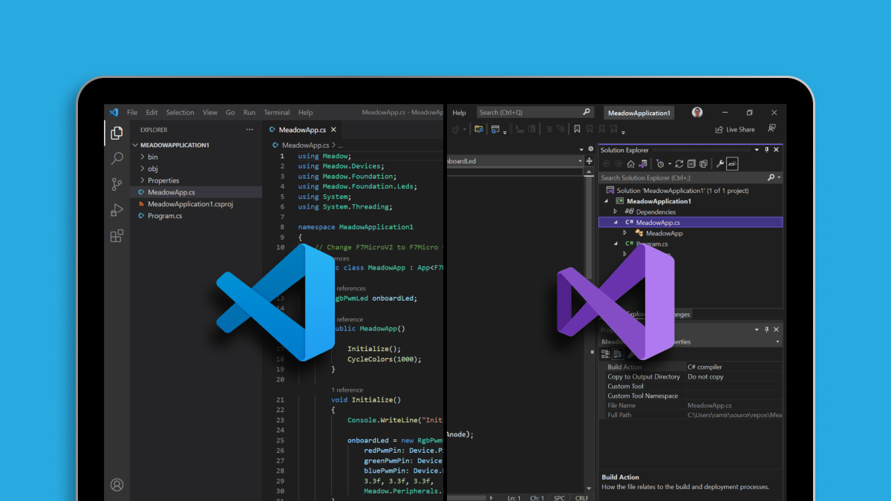
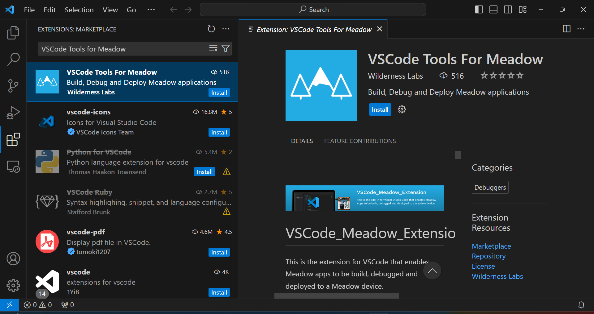

import Tabs from '@theme/Tabs';
import TabItem from '@theme/TabItem'

<Tabs>
  <TabItem value="visualstudio" label="Visual Studio 2022" default>

### Pre-requisites

The Meadow developer Extension for Visual Studio enables projects to be built, debugged and deployed to any of our Meadow-powered devices.

If you havent already, download and Install [Visual Studio](https://visualstudio.microsoft.com/) for either Windows or macOS to prepare your development machine. Community edition will work fine.

⚠️ **IMPORTANT**: Make sure to include the **.NET Multi-platform App UI development** component when installing Visual Studio.

### Installation

You'll need to install the VS Tools for Meadow Extension by [downloading it](https://marketplace.visualstudio.com/items?itemName=WildernessLabs.vsmeadow2022) or through the Extension Manager

1. In Visual Studio, go to Extensions =&gt; Manage Extensions
1. Click Online and search for Meadow.
1. Install VS Tools for Meadow, then close all instances of Visual Studio so the extension gets installed.

  </TabItem>
  <TabItem value="vscode" label="Visual Studio Code">
  

### Pre-requisites

If you havent, download and Install [Visual Studio Code](https://visualstudio.microsoft.com/) to prepare your development machine.

### Installation

1. In VSCode go to the Extensions tab (macOS: Cmd+Shift+X. Others: Ctrl+Shift+X)
1. In the search bar type VSCode Tools for Meadow. It should be the 1st extension in the list.

1. Click it the Install button on the bottom right of the listed item.
1. The extension should now be installed.

  </TabItem>
</Tabs>