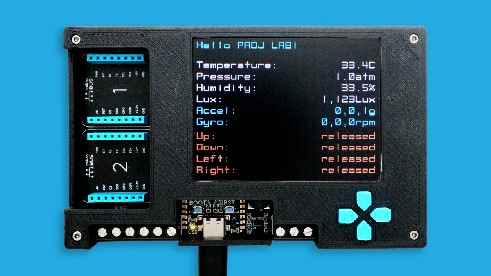

import Tabs from '@theme/Tabs';
import TabItem from '@theme/TabItem'

<Tabs>
  <TabItem value="visualstudio" label="Visual Studio 2022" default>

### Step 1 - Install .NET Runtime

Download and install the latest version of the [.NET runtime](https://dotnet.microsoft.com/en-us/download).

### Step 2 - Install Visual Studio

Download and Install [Visual Studio](https://visualstudio.microsoft.com/) for either Windows or macOS to prepare your development machine. Community edition will work fine.

### Step 3 - Add Meadow Visual Studio Extension

Open Visual Studio’s Extensions Manager and install the [VS 2022 Tools for Meadow](https://marketplace.visualstudio.com/items?itemName=WildernessLabs.vsmeadow2022) Extension.

### Step 4 - Deploy latest version of Meadow.OS

Use the [Meadow.CLI](https://developer.wildernesslabs.co/Meadow/Meadow_Basics/Meadow_CLI/) to deploy [Meadow.OS](https://developer.wildernesslabs.co/Meadow/Getting_Started/Deploying_Meadow/) to your board to ensure it’s running with the latest version available.

### Step 5 - Create your first Meadow application

[TBD]

### Step 6 - Deploy your application

Connect your board if disconnected, and in the **Meadow devices** drop down it should list its corresponding COM port. Once selected, click on the play **Debug button** to start transferring the application to your board.

**Note**: When deploying a project for the first time, the transfer will take several minutes, since it's transferring all the necessary libraries to run the application. Once the app is running for the first time, deployment will be faster as it will transfer only the files that you’ve changed.

Once all the files are transferred to your device, the app will start in debug mode and you should see your Project Lab loading up a screen with all the sensor values refreshing every few seconds. You can also press the push buttons and see their status change right away.

  </TabItem>
  <TabItem value="vscode" label="Visual Studio Code">

### Step 1 - Install .NET Runtime

Download and install the latest version of the [.NET runtime](https://dotnet.microsoft.com/en-us/download).

### Step 2 - Install Visual Studio Code

Download and Install [Visual Studio Code](https://visualstudio.microsoft.com/) to prepare your development machine.

### Step 3 - Add Meadow VSCode Extension

Open VSCode’s Extensions Manager and install [VSCode Tools for Meadow](https://marketplace.visualstudio.com/items?itemName=WildernessLabs.meadow) Extension.

### Step 4 - Deploy latest version of Meadow.OS

Use the [Meadow.CLI](https://developer.wildernesslabs.co/Meadow/Meadow_Basics/Meadow_CLI/) to deploy [Meadow.OS](https://developer.wildernesslabs.co/Meadow/Getting_Started/Deploying_Meadow/) to your board to ensure it’s running with the latest version available.

### Step 5 - Install Meadow Project Templates

Open a Terminal and enter the following command to install a list of Meadow project templates:

`dotnet new install WildernessLabs.Meadow.Template`

When installed, you’ll see a list of Templates available

### Step 6 - Create your first Meadow application

Lets verify everything is set up by deploying your first Meadow application. 

Open VSCode and in a new Terminal within, enter the following command to create a new Project Lab project:

`dotnet new MeadowPL -n ProjectLabDemo`

This project creates a Project Lab demo app that will activate all its onboard sensors (environmental, light and motion sensors, button states) and show its readings periodically on its 320x240 SPI display.

### Step 7 - Deploy your application

With no code changes, let's deploy this app to your new Project Lab.

In the bottom toolbar, click on the COM port button that will open a drop down menu at the top, where you’ll select the corresponding port your board is using.

**Note**: When deploying a project for the first time, the transfer will take several minutes, since it's transferring all the necessary libraries to run the application. Once the app is running for the first time, deployment will be faster as it will transfer only the files that you’ve changed.

Once all the files are transferred to your device, the app will start in debug mode and you should see your Project Lab loading up a screen with all the sensor values refreshing every few seconds. You can also press the push buttons and see their status change right away.

  </TabItem>
</Tabs>