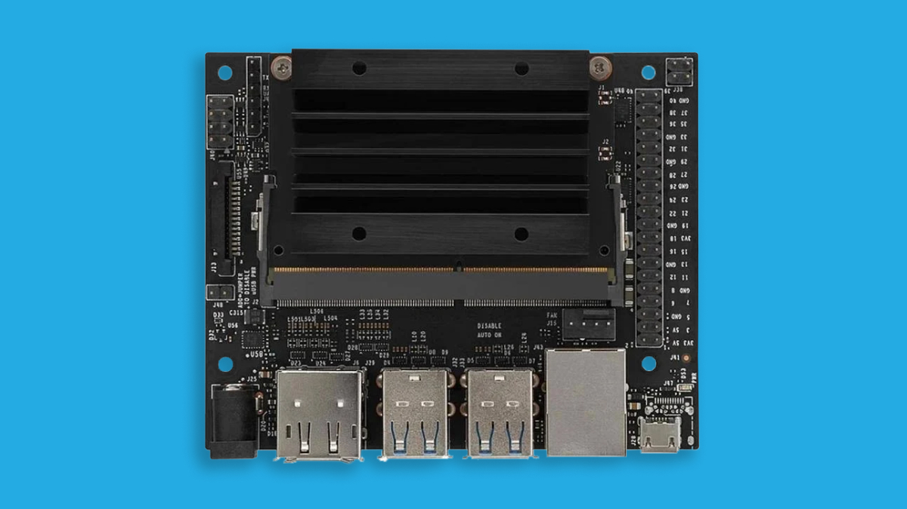

<Tabs groupId="ide">
  <TabItem value="visualstudiocode" label="Visual Studio Code" default>

### Step 1 - Install .NET Runtime

Follow this [blog post](https://www.petecodes.co.uk/install-and-use-microsoft-dot-net-8-with-the-raspberry-pi/) to download and install .NET on a [Raspberry Pi](https://www.raspberrypi.com/).

### Step 2 - Install Visual Studio Code

Download and Install [Visual Studio Code](https://visualstudio.microsoft.com/) to prepare your development machine.

### Step 3 - Install Meadow Project Templates

Open a Terminal and enter the following command to install a list of Meadow project templates:

```console
dotnet new install WildernessLabs.Meadow.Template
```

When installed, you’ll see a list of Templates available

```console
The following template packages will be installed:
   WildernessLabs.Meadow.Template

Success: WildernessLabs.Meadow.Template::1.8.0.1 installed the following templates:
Template Name                  Short Name         Language        Tags
-----------------------------  -----------------  --------------  --------------
Meadow Core-Compute App        CoreComputeModule  [C#],F#,VB.NET  Meadow/Console
Meadow F7 Feather App          F7Feather          [C#],F#,VB.NET  Meadow/Console
Meadow Library                 Library            [C#],F#,VB.NET  Meadow/Library
Meadow Project Lab App         ProjectLab         [C#]            Meadow/Console
Meadow.Linux Jetson Nano App   JetsonNano         [C#]            Meadow/Console
Meadow.Linux Raspberry Pi App  RaspberryPi        [C#]            Meadow/Console
Meadow.Linux reTerminal App    reTerminal         [C#]            Meadow/Console
Meadow.Windows + FT232H App    WinFormsHardware   [C#]            Meadow/Console
Meadow.Windows App             WinForms           [C#]            Meadow/Console
```

### Step 4 - Create your first Meadow application

Lets verify everything is set up by deploying your first Meadow application. 

Open VSCode and in a new Terminal within, enter the following command to create a new Meadow.Linux project that will run on your Raspberry Pi:

```console
dotnet new JetsonNano -n JetsonNanoDemo
```

This Meadow.Linux application shows a basic Meadow app structure with an `Initialize` and `Run` methods with logging strings to confirm in the output the application ran successfully.


### Step 5 - Run your application

Lets run this application as is on your Raspberry Pi. In a terminal inside the project folder, build the project with the command:

```console
dotnet build
```

And finally to run the Meadow application, use the command:

```console
dotnet run
```

At that point, you should see the application’s output in the console and the RGB LED cycling through different colors:

```console
Log level: Information
Platform does not support gpiod
Update Service is disabled.
Health Metrics disabled.
Initialize...
Run...
Hello, Jetson Nano!
```

  </TabItem>
</Tabs>