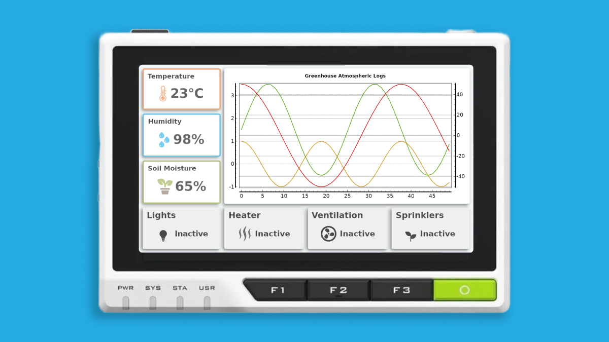
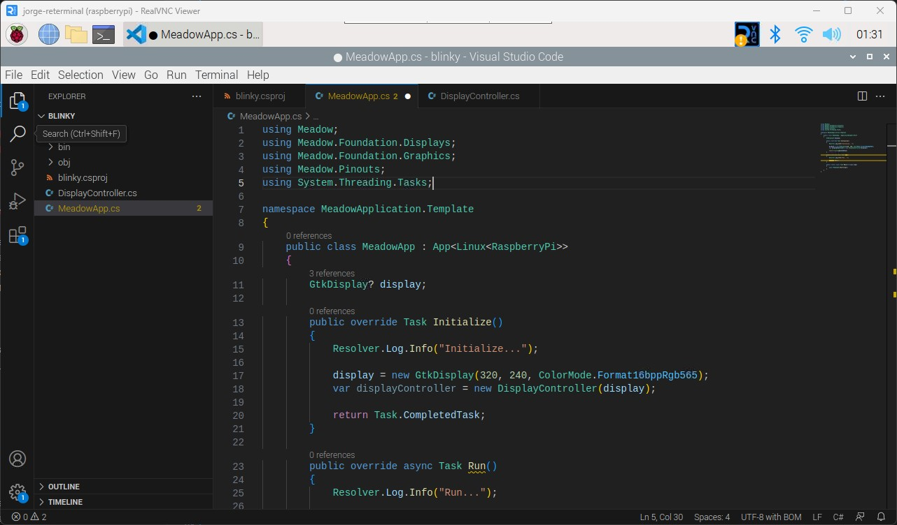

<Tabs groupId="ide">
  <TabItem value="visualstudio2022" label="Visual Studio 2022" default>

### Step 1 - Install .NET Runtime

Download and install the latest version of the [.NET runtime](https://dotnet.microsoft.com/en-us/download).

### Step 2 - Install Visual Studio

Download and Install [Visual Studio 2022](https://visualstudio.microsoft.com/) for Windows to prepare your development machine. Community edition will work fine.

### Step 3 - Install Meadow Project Templates

Open a console window and enter the following command to install a list of Meadow project templates:

```console
dotnet new install WildernessLabs.Meadow.Template
```

When installed, you’ll see a list of templates available:

```console
The following template packages will be installed:
   WildernessLabs.Meadow.Template

Success: WildernessLabs.Meadow.Template::1.8.0.1 installed the following templates:
Template Name                  Short Name           Language        Tags
-----------------------------  -------------------  --------------  --------------
Meadow Core-Compute App        meadow-ccm           [C#],F#,VB.NET  Meadow/Console
Meadow F7 Feather App          meadow-feather       [C#],F#,VB.NET  Meadow/Console
Meadow Library                 meadow-library       [C#],F#,VB.NET  Meadow/Library
Meadow Project Lab App         meadow-project-lab   [C#]            Meadow/Console
Meadow.Desktop App             meadow-desktop       [C#]            Meadow/Console
Meadow.Linux Jetson Nano App   meadow-jetson-nano   [C#]            Meadow/Console
Meadow.Linux Raspberry Pi App  meadow-raspberry-pi  [C#]            Meadow/Console
Meadow.Linux reTerminal App    meadow-reterminal    [C#]            Meadow/Console
```

### Step 4 - Add VS Linux Debugger Studio Extension

Open Visual Studio’s Extensions Manager and install the [VS Linux Debugger](https://marketplace.visualstudio.com/items?itemName=SuessLabs.VSLinuxDebugger) Extension.

Make sure you go through their Getting Started instructions to properly configure the target device (reTerminal) and how to use the extension to build and deploy the Meadow.Linux application over the network.

### Step 5 - Create your first Meadow application

In **Visual Studio**, open the **Create a new project** window. When you search for **Meadow**, you will see a list of project templates, click on **Meadow.Linux reTerminal App (Wilderness Labs)**:


When this application runs, it'll show a 320x240 window in the center of the reTerminal's screen with a label saying `Hello World` using [MicroLayout](../../../Meadow.Foundation/Libraries_and_Frameworks/MicroLayout/index.md).

### Step 6 - Run a Meadow Application

Once the application is deployed successfully, open a terminal on the reTerminal and go to inside the project's folder and type:

```console
dotnet [Your Project Name].dll
```

The terminal will output a few console output strings in the MeadowApp and a GTK screen will appear in the center saying `Hello World`.

```console
Initializing OS... 
Using default app.config.yaml...
Log level: Information
Platform does not support gpiod
Update Service is disabled.
Health Metrics disabled.
Initialize...
Run...
Hello, reTerminal!
```


### Step 7 - Check out additional samples

You can check more samples in our [Meadow.Samples](https://github.com/WildernessLabs/Meadow.Samples/tree/main) GitHub repo.


  </TabItem>
  <TabItem value="visualstudiocode" label="Visual Studio Code">

### Step 1 - Install .NET Runtime

Follow this [blog post](https://www.petecodes.co.uk/install-and-use-microsoft-dot-net-8-with-the-raspberry-pi/) to download and install .NET on a [Raspberry Pi](https://www.raspberrypi.com/).

### Step 2 - Install Visual Studio Code

Download and Install [Visual Studio Code](https://visualstudio.microsoft.com/) to prepare your development machine.

### Step 3 - Install Meadow Project Templates

Open a console window and enter the following command to install a list of Meadow project templates:

```console
dotnet new install WildernessLabs.Meadow.Template
```

When installed, you’ll see a list of templates available:

```console
The following template packages will be installed:
   WildernessLabs.Meadow.Template

Success: WildernessLabs.Meadow.Template installed the following templates:
Template Name                  Short Name           Language        Tags
-----------------------------  -------------------  --------------  --------------
Meadow Core-Compute App        meadow-ccm           [C#],F#,VB.NET  Meadow/Console
Meadow F7 Feather App          meadow-feather       [C#],F#,VB.NET  Meadow/Console
Meadow Library                 meadow-library       [C#],F#,VB.NET  Meadow/Library
Meadow Project Lab App         meadow-project-lab   [C#]            Meadow/Console
Meadow.Desktop App             meadow-desktop       [C#]            Meadow/Console
Meadow.Linux Jetson Nano App   meadow-jetson-nano   [C#]            Meadow/Console
Meadow.Linux Raspberry Pi App  meadow-raspberry-pi  [C#]            Meadow/Console
Meadow.Linux reTerminal App    meadow-reterminal    [C#]            Meadow/Console
```

### Step 4 - Create your first Meadow application

Lets verify everything is set up by deploying your first Meadow application.

Open VSCode and in a new Terminal within, enter the following command to create a new Meadow.Linux project that will run on your Raspberry Pi:

```console
dotnet new reTerminal --name reTerminalDemo
```

This Meadow.Linux application shows a basic Meadow app structure with an `Initialize` and `Run` methods with logging strings to confirm in the output the application ran successfully.



### Step 5 - Run a Meadow Application

Lets run this application as is on your Raspberry Pi. In a terminal inside the project folder, build the project with the command:

```console
dotnet build
```

And finally to run the Meadow application, use the command:

```console
dotnet run
```

A GTK window should show up in the center of the screen saying `Hello, World`, like below:


And if you check the output you should see something like this:

```console
Log level: Information
Platform does not support gpiod
Update Service is disabled.
Health Metrics disabled.
Initialize...
Run...
Hello, reTerminal!
```

### Step 6 - Check out additional samples

You can check more samples in our [Meadow.Samples](https://github.com/WildernessLabs/Meadow.Samples/tree/main) GitHub repo.


  </TabItem>
</Tabs>