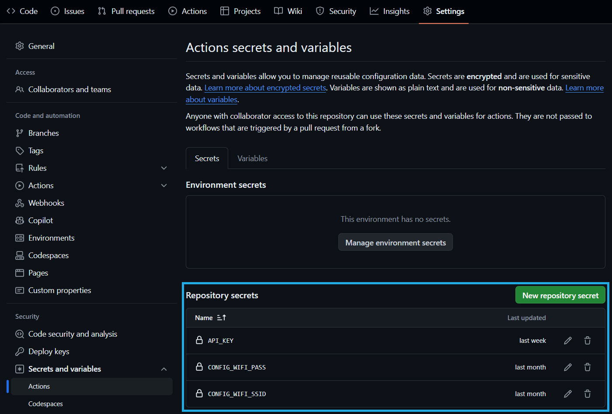

With GitHub Actions, you can automate the complete process of building, testing, and uploading Meadow MPAK files to Meadow.Cloud using [`meadow-cloud-package-upload`](https://github.com/WildernessLabs/meadow-cloud-package-upload) action. It provides an integrated solution for managing the deployment pipeline of Meadow-based applications.

The **Deploy and Upload Meadow MPAK** action combines building, testing, packaging, and uploading processes into a single workflow. This ensures that your Meadow applications are compiled, tested, and deployed efficiently and consistently across your development team.

## Ensure your Meadow device receives OTA Updates

### Step 1 - Provision your device to Meadow.Cloud

### Step 2 - Ensure your Meadow App connects to a WiFi network

### Step 3 - Enable Meadow.Cloud features including OTA updates

### Step 4 - Implement Meadow.Cloud events to download and apply incoming updates

## Meadow.Cloud Uploader and Publisher

### Step 2 - Get a Meadow.Cloud API Key

To configure our Meadow.Cloud publisher, login to your Meadow.Cloud account, click on your profile photo and select "Your API Keys". Once there, create an API Key, and save it somewhere safe, as you'll need it further down this guide.


### Step 3 - Get Organization ID and Collection ID

In your Meadow.Cloud account, go to your Collections section and copy the ID and keep it somewhere handy.


You'll also need your Organization ID. Click on your profile and select "Your Organizations", and copy the ID value there as well.


### Step 4 - Create API Key and WIFI Secrets

So you dont check-in your WiFi credentials nor Meadow.Cloud API key, you can create your secrets and add them there, since we'll need to reference them later on when building the GitHub Actions workflow script.

Head over to your repo, and go to the Settings tab



### Step 1 - Create a GitHub action Workflow

In your repository, add a `.github` folder if you havent already and inside add a `workflows` folder. Finally, create a workflow file, `main.yml` for example.


```yml
name: Upload/Publish MPAK

on:
  workflow_dispatch:

jobs:
  deploy:
    runs-on: ubuntu-latest
    steps:
    - name: Build+Upload
      uses: WildernessLabs/meadow-cloud-package-upload@v1.0.0
      with:        
        ORGANIZATION_ID: "5b1d2b0dab744a04b79b245d881e18b8" # set this to your organization
        API_KEY: ${{ secrets.API_KEY }} # set this to an api key that has package scope        
        #CLI_VERSION: "2.0.30" # Optional, set this to the CLI version if required
        OS_VERSION: "1.11.1.44" # Optional, set this to the OS version if required        
        CONFIGS : '{"CONFIG_WIFI_SSID": "${{ secrets.CONFIG_WIFI_SSID }}", "CONFIG_WIFI_PASS": "${{ secrets.CONFIG_WIFI_PASS }}"}' # Optional, set this to a matching token to replaced within your *.yaml files if required
        HOST: "https://staging.meadowcloud.dev" # set this to the API URL and if not specified will publish to production  
    - name: Publish
      uses: WildernessLabs/meadow-cloud-package-publish@v1.0.0
      with:        
        API_KEY: ${{ secrets.API_KEY }} # set this to an api key that has package scope        
        COLLECTION_ID: "4965ba4d6b504c879928494e9bbe415d" # set this to an api key that has package scope        
        HOST: "https://staging.meadowcloud.dev" # set this to the API URL and if not specified will publish to production  
        METADATA: "metadata part of my publish" # Optional, set this to the desired metadata for publish if required
```

### Step 3 - 

### Step 4 - 

### Step 5 - 

## Meadow.Cloud Publisher

### Step 1 - 

### Step 2 - 

### Step 3 - 

### Step 4 - 

### Step 5 - 