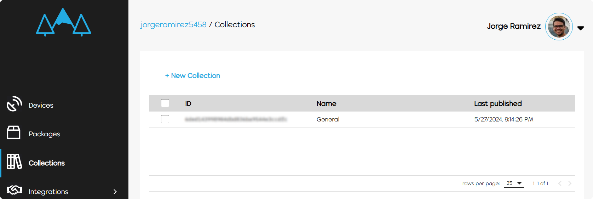

With GitHub Actions, you can automate the complete process of building, uploading and publishing Meadow MPAK files to Meadow.Cloud using [`meadow-cloud-package-upload`](https://github.com/WildernessLabs/meadow-cloud-package-upload) and [`meadow-cloud-package-publish`](https://github.com/WildernessLabs/meadow-cloud-package-publish) actions. It provides an integrated solution for managing the deployment pipeline of Meadow-based applications.

The **Deploy and Upload Meadow MPAK** action combines building, testing, packaging, and uploading processes into a single workflow. This ensures that your Meadow applications are compiled, tested, and deployed efficiently and consistently across your development team.

## Ensure your Meadow device receives OTA Updates

Before you continue with this guide, make sure your Meadow application has [over-the-air updates](../OtA_Updates/index.md) enabled. You can also head over to our [Meadow.Samples](https://github.com/WildernessLabs/Meadow.Samples) repo where you can check OTA Update samples under the Meadow.Cloud section.

## Meadow.Cloud Uploader and Publisher

To configure our Meadow.Cloud publisher in your repository, follow these steps:

### Step 1 - Get a Meadow.Cloud API Key

Login to your Wilderness Labs account in the [Meadow.Cloud](https://www.meadowcloud.co/) site, click on your profile photo and select **Your API Keys**. Once there, create an API Key, and save it somewhere safe, as you'll need it further down when creating the GitHub Actions workflow script.


### Step 2 - Get Organization ID and Collection ID

In your Meadow.Cloud site, go to the **Collections** section and copy the `Collections ID` and keep it somewhere handy.



You'll also need the `Organization ID`. Click on your profile and select **Your Organizations**, and copy the ID value there as well.


### Step 3 - Create API Key and WIFI Secrets

So you dont check-in your WiFi credentials nor your API key, you can create your secrets and add them there. We'll need to reference them later on the GitHub Actions workflow script.

Head over to your repo, and go to the **Settings** tab, **Secrets and variables** under the **Security** section, and enter the repository secrets for your WiFi credentials and API Key.


### Step 4 - Create a GitHub action Workflow

In your repository, add a `.github` folder if you havent already and inside add a `workflows` folder. Finally, create a workflow file, `main.yml` for example. Copy the following code block:

```yml
name: Upload/Publish MPAK

on:
  workflow_dispatch:

jobs:

  deploy:

    runs-on: ubuntu-latest

    steps:

    - name: Build + Upload
      uses: WildernessLabs/meadow-cloud-package-upload@v1.0.0
      with:        
        ORGANIZATION_ID: "<YOUR ORGANIZATION ID>" # Required, set this to your organization
        API_KEY: ${{ secrets.API_KEY }} # Required, set this to an api key that has package scope        
        OS_VERSION: "1.12.0.0" # Optional, set this to the OS version if required        
        CONFIGS : '{"CONFIG_WIFI_SSID": "${{ secrets.CONFIG_WIFI_SSID }}", "CONFIG_WIFI_PASS": "${{ secrets.CONFIG_WIFI_PASS }}"}' # Optional, set this to a matching token to replaced within your *.yaml files if required
        
    - name: Publish
      uses: WildernessLabs/meadow-cloud-package-publish@v1.0.0
      with:        
        API_KEY: ${{ secrets.API_KEY }} # Required, set this to an api key that has package scope        
        COLLECTION_ID: "<YOUR COLLECTION ID>" # Required, set this to an api key that has package scope        
        METADATA: "metadata part of my publish" # Optional, set this to the desired metadata for publish if required
```

Make sure to paste your ``Organization ID`` and ``Collection ID`` in the corresponding fields.

### Step 5 - Publish an update

If you configured your script properly, you can finally publish app updates from GitHub Actions. Head over to your repo, select the **Actions** tab, and select the workflow you just created. Click the **Run workflow** button to publish an update.

