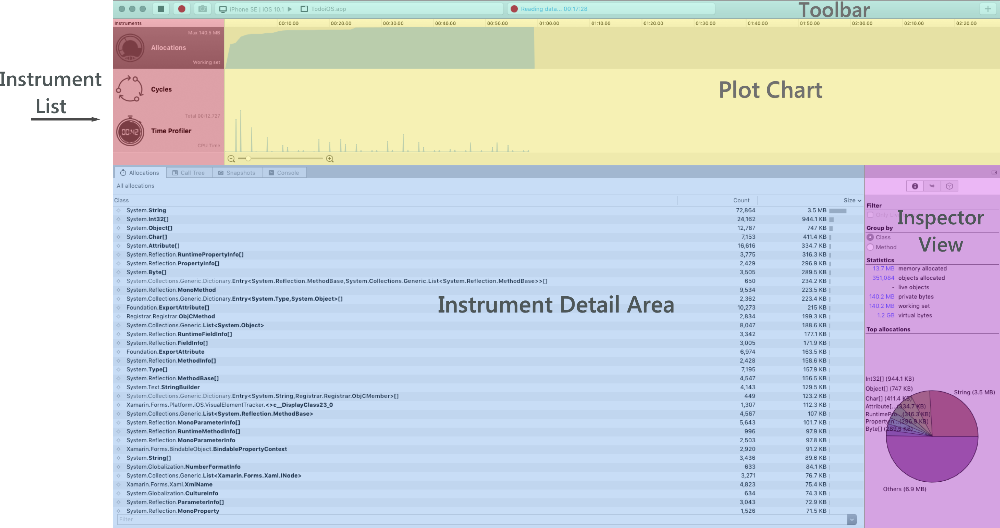

# Mono Log Profiler

The Mono log profiler can be used to collect a lot of information about a program running in the Mono runtime. This data can be used (both while the process is running and later) to do analyses of the program behaviour, determine resource usage, performance issues or even look for particular execution patterns.

The events collected include (among others):

- method enter and leave
- object allocation
- garbage collection
- JIT compilation
- metadata loading
- lock contention
- exceptions

# How to use the Mono log profiler on Meadow

Profiling on Meadow is pretty simple, you just need to follow a few steps:

## Step 1: Enable the Profiler on your Meadow config file

To configure the Mono profiler and specify the data to collect, add the profiler control option to your `meadow.config.yaml` file. Due to the potential for high data volume and memory consumption, especially on resource-constrained devices, consider the following examples to minimize performance overhead and memory usage:

#### Example 1: Configure Mono profiler to log method calls with a call depth of 10, excluding allocation information
```
MonoControl:
  Options: --profile=log:noalloc,calls,calldepth=10
```

#### Example 2: Configure heapshot logs every 10 seconds:
```
MonoControl:
  Options: --profile=log:noalloc,calls,calldepth=10
```

#### Example 3: Configure Mono profiler to log method calls without allocation information
```
MonoControl:
  Options: --profile=log:noalloc
```

> Important: Some options consume a lot of memory and should be avoided, due to the limited memory of the embedded device, such as `alloc`. The Mono documentation also provides more detailed tips about [how to collect less data](https://www.mono-project.com/docs/debug+profile/profile/profiler/#collect-less-data).

## Step 2: Reserve the UART1 (COM1) pins in your Meadow config file.

Assuming that you are using the `COM1` on the `Project Lab v3.e` or in the `F7 Feather V2`, you should add the following in your `meadow.config.yaml` to reserve the pins `B15` and `B14`:
```
Device:
    ReservedPins: B15;B14 # MCU pin names
```

> It's important to notice that the `ReservedPins` field requires the MCU pin names, which are not the ones you see on the board. If you are using another device, please consult the pinout definition in its datasheet to use the corresponding MCU pin names.

## Step 3: Getting the profiling data from the serial port

After connecting a USB serial converter to your Meadow device UART1 (COM1), run the `meadow uart profiler enable` CLI command, which will read the data from UART1 (COM1) and save it as an `output.mlpd` file in your computer, e.g.:

```bash
meadow uart profiler enable -i /dev/tty.usbserial-1120 -o ./
```

To learn more about this command you can run:

```bash
meadow uart profiler enable --help
```

That should show more details about this CLI command:

```
USAGE
  meadow uart profiler enable --interface <value> [options]

DESCRIPTION
  Enables profiling data output to UART

OPTIONS
* -i|--interface    Set the serial interface to read the profiling data via COM1 
  -o|--outputDirectory  Set the profiling data output directory path 
```

## Step 4: Generating reports for a `.mlpd` file 

Given the `.mlpd` obtained in the last step, you can use a report generator, such as the [mprof-report (CLI)](https://www.mankier.com/1/mprof-report) or the [Xamarin Profiler (GUI)](https://learn.microsoft.com/en-us/xamarin/tools/profiler/?tabs=windows) to generate a report:


# Troubleshooting
If you experience slowdowns in your application or `memalign` errors, try reducing the amount of data collected.

It's important to notice that when no profiler option is specified as below:

```
MonoControl:
    Options: --profile=log
```

It is equivalent to using the following: 

```
MonoControl:
    Options: --profile=log:calls,alloc,maxframes=8,calldepth=100
```

It will collect a lot of data, potentially causing `memalign` errors due to the limited embedded RAM.

To know more about the profiler's options, consult the [Mono log profiler documentation](https://www.mono-project.com/docs/debug+profile/profile/profiler/#profiler-option-documentation), but here are some examples explained briefly of how to collect less data:

- **Example 1:** Heap shot data can also be huge, but to reduce the frequency, you can specify a heap shot mode: for example to collect every 10 seconds passed since the last heap shot:

```
MonoControl:
    Options: --profile=log:heapshot=10000ms,noalloc,nocalls
```

- **Example 2:** Method enter/leave events can be excluded completely with the `nocalls` option or they can be limited to just a few levels of calls with the `calldepth` option. For example, the option:
```
MonoControl:
    Options: --profile=calls,noalloc,calldepth=10
```