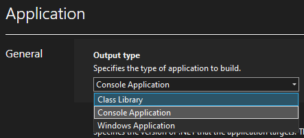

If you are updating Meadow.OS beta applications to the new Meadow.OS release candidate application lifecycle, there are some required code updates.

## Does this apply to me?

After updating your Meadow board to the latest Meadow.OS, you will need to update your project to run with the latest application lifecycle if you are seeing the following error message in the Meadow output log.

```console
...
Meadow StdOut: Assembly '/meadow0/Meadow.dll' doesn't have an entry point.

Visual Studio has stopped debugging
```

## How do I update my Meadow app?

1. Update to the latest Meadow NuGet packages that include the latest application lifecycle updates.
1. In the project properties, change **Application** > **General** > **Output type** to `Class Library` (previously Console Application).
    
1. In your MeadowApp class declaration, remove the second `MeadowApp` type parameter from the class' inherited `App` type.

    ```csharp
    public class MeadowApp : App<F7FeatherV2>
    ```

1. Remove the **Program.cs** file from your project.
    With the new lifecycle, this extra file isn't required anymore.
1. Going forward, the preferred way of initializing and running your Meadow app is done using overridden `Run` and `Initialize` methods.
    (The prior system of constructor and calls to an initialization method will continue working for now.
    1. Override the `Run` and `Initialize` methods of `App`.

        ```csharp
        public override Task Initialize()
        {
            return base.Initialize();
        }
        
        public override Task Run()
        {
            return base.Run();
        }
        ```

    1. Migrate your code from your constructor into these new `Run` and `Initialize` methods.
