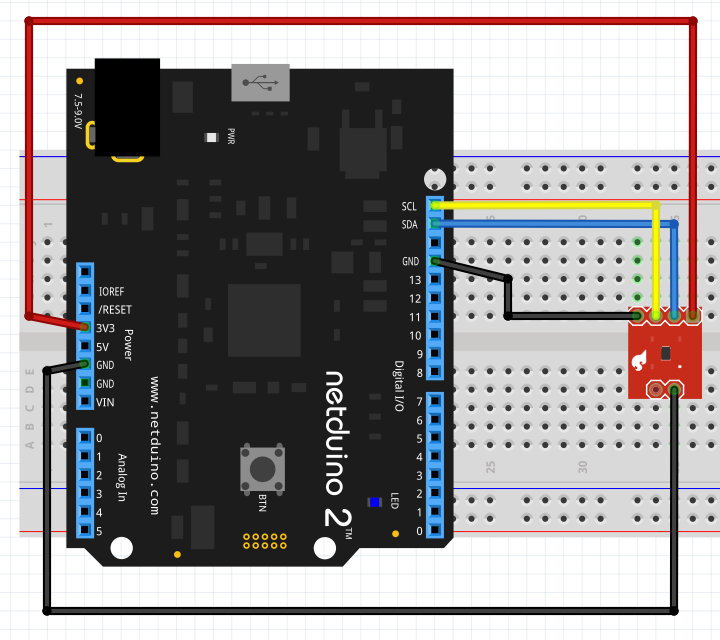

This example demonstrates how to read from and write to a [TMP102 temperature sensor](https://www.sparkfun.com/products/13314) using the I2C protocol.

The full discussion can be found in the [Wilderness Labs Developer](http://developer.wildernesslabs.co/Netduino/Input_Output/Digital/I2C/Writing/) portal.

### Hardware



## Code

```csharp
using Microsoft.SPOT;
using Microsoft.SPOT.Hardware;
using System.Threading;

namespace TMP102ReadWrite
{
    public class Program
    {
        /// <summary>
        /// Convert a byte to a two character hex string.
        /// </summary>
        /// <returns>Hexadecimal representation of the byte as a string.</returns>
        /// <param name="val">Byte to convert into a string.</param>
        public static string ByteToHex(byte val)
        {
            const string hex = "0123456789abcdef";
            return(new string(new char[] { '0', 'x', hex[(val & 0xf0) >> 4], hex[val & 0x0f] }));
        }

        /// <summary>
        /// Reads the TMP 102 configuration.
        /// </summary>
        /// <remarks>
        /// Create transactions to read the current configuration.  A write transaction
        /// is necessary to change the pointer register to point to the configuration
        /// registers.  A read transaction will then read the current configuration.
        /// </remarks>
        /// <param name="device">TMP102 I2CDevice object to read the configuration from.</param>
        private static byte[] ReadTMP102Configuration(I2CDevice device)
        {
            I2CDevice.I2CTransaction[] readConfiguration = new I2CDevice.I2CTransaction[2];
            byte[] pointerBuffer = new byte[1];
            pointerBuffer[0] = 1;
            readConfiguration[0] = I2CDevice.CreateWriteTransaction(pointerBuffer);
            //
            byte[] currentConfig = new byte[2];
            readConfiguration[1] = I2CDevice.CreateReadTransaction(currentConfig);
            device.Execute(readConfiguration, 100);
            Debug.Print("Configuration register: " + ByteToHex(currentConfig[0]) + ", " + ByteToHex(currentConfig[1]));
            return (currentConfig);
        }

        /// <summary>
        /// Main program loop.
        /// </summary>
        public static void Main()
        {
            //
            //  Create a new I2C device for the TMP102 on address 0x48 with the clock
            //  running at 50 KHz.
            //
            I2CDevice tmp102 = new I2CDevice(new I2CDevice.Configuration(0x48, 50));
            //
            //  Read the configuration prior to updating the conversion mode to 13-bit mode.
            //
            byte[] currentConfig = ReadTMP102Configuration(tmp102);
            //
            //  Now we have the configuration, set up to change the configuration between
            //  12 and 13 bit mode and read data from the sensor.
            //
            I2CDevice.I2CTransaction[] changeConfig = new I2CDevice.I2CTransaction[1];
            byte[] newConfiguration = { 0x01, currentConfig[0], (byte) (currentConfig[1] | 0x10) };
            changeConfig[0] = I2CDevice.CreateWriteTransaction(newConfiguration);
            tmp102.Execute(changeConfig, 100);
            Thread.Sleep(1000);
            //
            //  Now setup for reading the temperature.
            //
            I2CDevice.I2CTransaction[] reading = new I2CDevice.I2CTransaction[2];
            byte[] repointToTemperatureRegister = { 0x00 };
            reading[0] = I2CDevice.CreateWriteTransaction(repointToTemperatureRegister);
            byte[] temperatureData = new byte[2];
            reading[1] = I2CDevice.CreateReadTransaction(temperatureData);
            while (true)
            {
                //
                //  Read the temperature.
                //
                int bytesRead = tmp102.Execute(reading, 100);
                Debug.Print("Temperature data: "+ ByteToHex(temperatureData[0]) + ", " + ByteToHex(temperatureData[1]));
                //
                //  Convert the reading into Centigrade and Fahrenheit.
                //
                int sensorReading = 0;
                double centigrade = -273.15;
                double fahrenheit = centigrade * 1.8 + 32;
                if ((temperatureData[1] & 0x01) == 1)
                {
                    sensorReading = ((temperatureData[0] << 5) | (temperatureData[1]) >> 3);
                    Debug.Print("13-bit value retrieved.");
                }
                else
                {
                    sensorReading = ((temperatureData[0] << 4) | (temperatureData[1]) >> 4);
                    Debug.Print("12-bit value retrieved.");
                }
                centigrade = sensorReading * 0.0625;
                fahrenheit = centigrade * 1.8 + 32;
                //
                //  Display the readings in the debug window and pause before repeating.
                //
                Debug.Print(centigrade.ToString() + " C / " + fahrenheit.ToString() + " F");
                Thread.Sleep(1000);
            }
        }
    }
}
```

## Hardware Required

* Netduino
* [TMP102 I2C Temperature Sensor](https://www.sparkfun.com/products/13314)


## [Netduino Samples Github Repository](https://github.com/WildernessLabs/Netduino_Samples)

Full source code for all of the samples can be found in the Netduino Samples repository on Github.