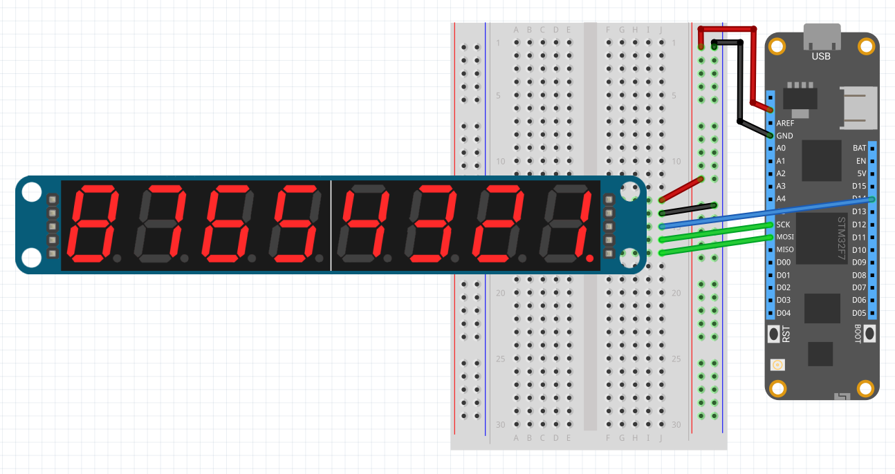

| Max7219 | |
|--------|--------|
| Status |  |
| Source code | [GitHub](https://github.com/WildernessLabs/Meadow.Foundation/tree/main/Source/Meadow.Foundation.Peripherals/Displays.Max7219) |
| Datasheet(s) | [GitHub](https://github.com/WildernessLabs/Meadow.Foundation/tree/main/Source/Meadow.Foundation.Peripherals/Displays.Max7219/Datasheet) |
| NuGet package | <a href="https://www.nuget.org/packages/Meadow.Foundation.Displays.Max7219/" target="_blank"></a> |

The **MAX7219** is an LED display driver capable of driving 64 outputs. As well, the MAX7219 contains an 2-wire data bus allowing multiple MAX7219 chip to be connected together and controlled by a single I2C interface.

Although the MAX7219 can be used as a general purpose IO expander, it almost exclusively used to drive either 2-dimensional LED arrays (commonly 8x8) or an array of multi-segment displays (commonly 8 7-segment displays). The MAX7219 contains specific logic to display pre-configured characters when driving 7 segment displays, specifically: 0-9, E, H, L, P and -.

As it's most commonly used to as a display controller, you'll find it in the Meadow.Foundation.Displays namespace.

### Code Example

```csharp
Max7219 display;

public override Task Initialize()
{
    Resolver.Log.Info("Initialize...");

    display = new Max7219(Device.CreateSpiBus(), Device.Pins.D01, 1, Max7219.Max7219Mode.Character);

    return base.Initialize();
}

void TestCharacterMode()
{
    display.SetMode(Max7219.Max7219Mode.Character);
    //show every supported character 
    for (int i = 0; i < (int)Max7219.CharacterType.Count; i++)
    {
        for (int digit = 0; digit < 8; digit++)
        {
            display.SetCharacter((Max7219.CharacterType)i, digit, i % 2 == 0);
        }
        display.Show();
    }
}

void TestDigitalMode()
{
    Resolver.Log.Info("Digital test");

    display.SetMode(Max7219.Max7219Mode.Digital);
    //control individual LEDs - for 8x8 matrix configurations - use the Meadow graphics library
    for (byte i = 0; i < 64; i++)
    {
        for (int d = 0; d < 8; d++)
        {
            display.SetDigit(i, d);
        }
        display.Show();
    }
}

public override Task Run()
{
    while (true)
    {
        TestDigitalMode();
        TestCharacterMode();
    }
}

```

[Sample project(s) available on GitHub](https://github.com/WildernessLabs/Meadow.Foundation/tree/main/Source/Meadow.Foundation.Peripherals/Displays.Max7219/Samples/Max7219_Sample)

### Wiring Example

To wire a Max7219 to your Meadow board, connect the following:


